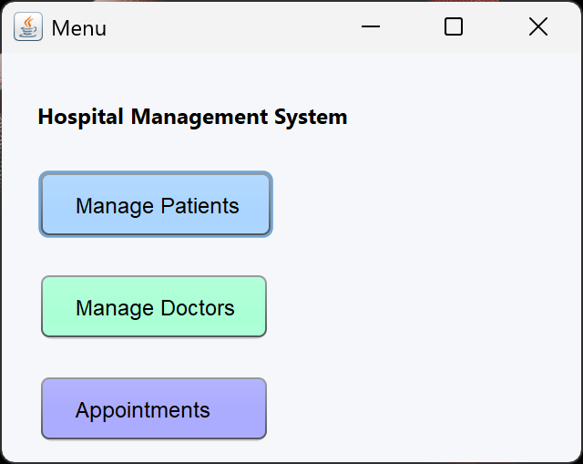
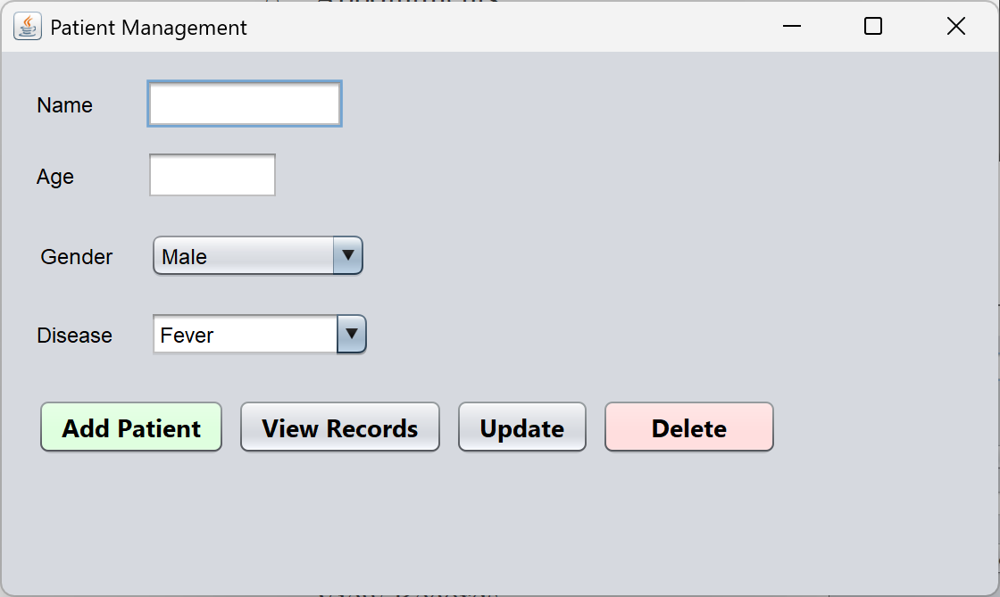
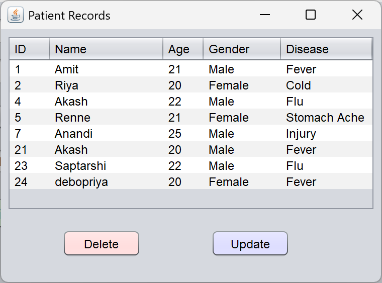
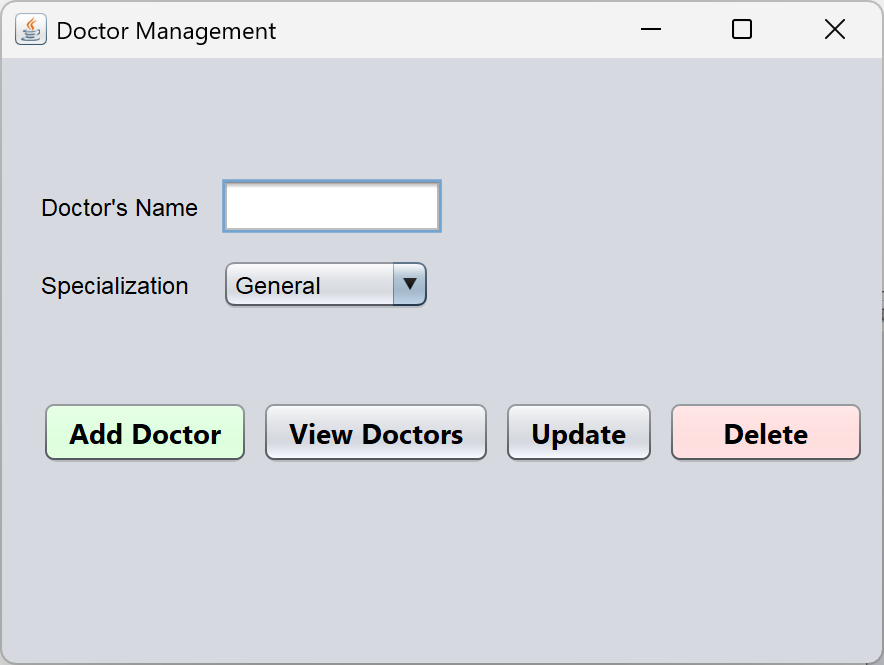
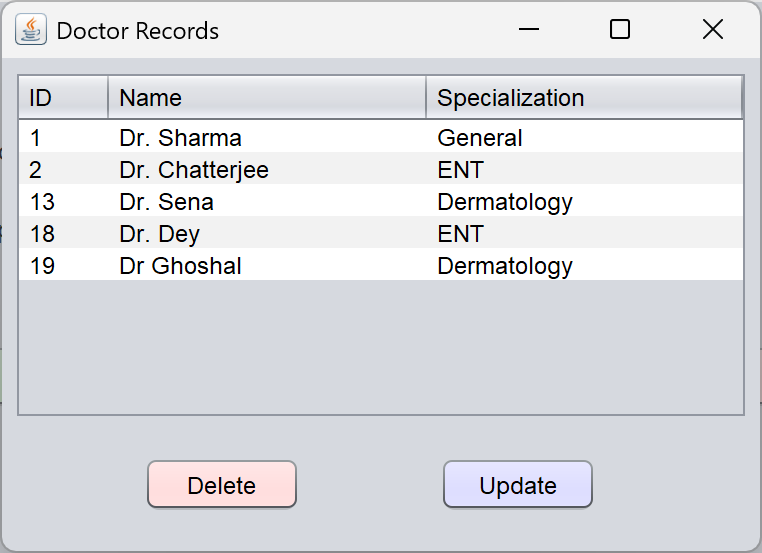
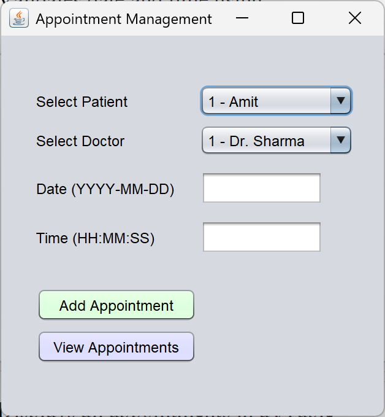
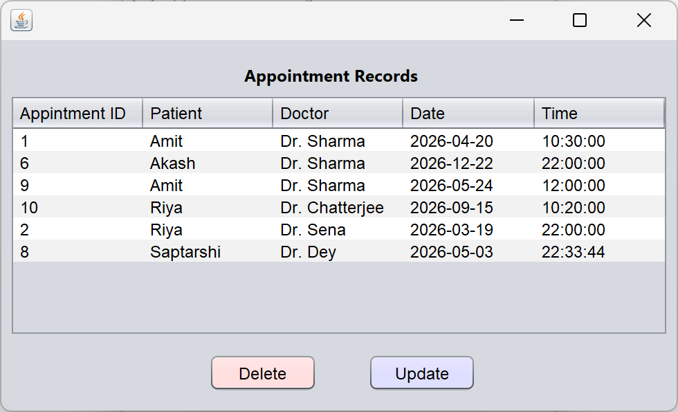

# 🏥 Hospital Management System


> A desktop-based hospital management system with full CRUD functionality and database integration.

A **Java Swing + MySQL desktop application** to manage hospital operations like patient records, doctor details, and appointment scheduling — built using clean GUI design and strong OOP principles.

---

## 🚀 Features

* Manage patient records (Add, View, Update, Delete)
* Doctor management system
* Appointment scheduling and tracking
* GUI-based desktop interface (Java Swing)
* MySQL database integration
* Packaged as executable `.jar` application

---

## ⭐ Key Highlights

* Full CRUD operations implemented across modules
* Relational database design with foreign key constraints
* Dynamic data loading using JDBC
* Clean GUI navigation across multiple panels
* Packaged as standalone executable application

---

## 🛠 Tech Stack

* Java (Swing)
* MySQL
* JDBC
* Object-Oriented Programming (OOP)

---

## 📂 Project Structure

```
HospitalManagementSystem/
├── src/              # Java source code
├── dist/             # Executable JAR file
├── nbproject/        # NetBeans configuration
```

---

## ▶️ How to Run

1. Install Java (JDK 8 or above)
2. Set up MySQL and create required tables
3. Run the application:

```
java -jar HospitalManagementSystem.jar
```

---

## 🗄️ Database Setup

```sql
CREATE DATABASE hospital;
USE hospital;

CREATE TABLE patients (
  patient_id INT AUTO_INCREMENT PRIMARY KEY,
  name VARCHAR(100),
  age INT,
  gender VARCHAR(10),
  disease VARCHAR(100)
);

CREATE TABLE doctors (
  doctor_id INT AUTO_INCREMENT PRIMARY KEY,
  name VARCHAR(100),
  specialization VARCHAR(100)
);

CREATE TABLE appointments (
  appointment_id INT AUTO_INCREMENT PRIMARY KEY,
  patient_id INT,
  doctor_id INT,
  date DATE,
  time TIME,
  FOREIGN KEY (patient_id) REFERENCES patients(patient_id),
  FOREIGN KEY (doctor_id) REFERENCES doctors(doctor_id)
);
```

---

## 🧠 What I Learned

* Building real-world desktop applications
* GUI development using Java Swing
* Database connectivity using JDBC
* Applying OOP concepts in projects

---

## 📌 Future Improvements

* Add authentication/login system
* Improve UI/UX design
* Add reporting and analytics
* Convert into web-based application

---

## 👨‍💻 Author

**Agniva Chatterjee**

---

⭐ If you found this project useful, consider giving it a star!

---

## 📸 Screenshots

### 🏠 Main Dashboard



### 👤 Patient Management




### 👨‍⚕️ Doctor Management




### 📅 Appointment System



